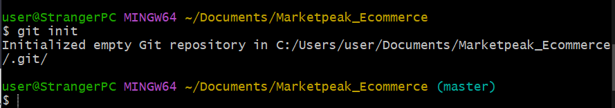
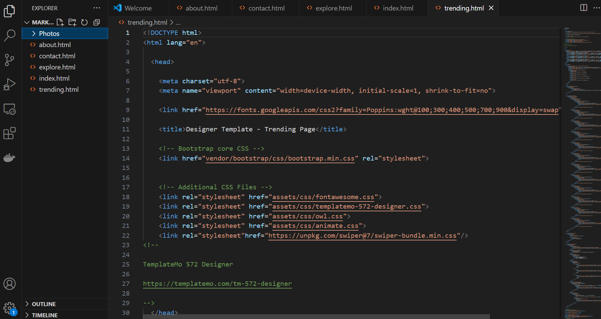
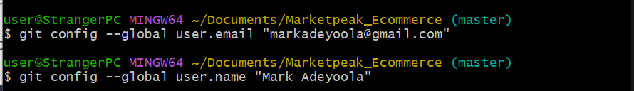
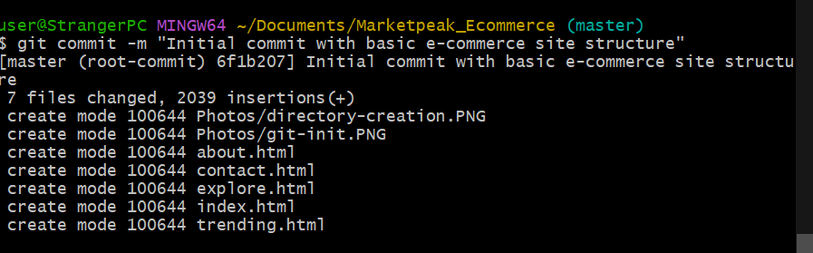

# Development of an ecommerce website for  "Marketpeak"

## Task 1.1
First i created a directory on my local machine named "Market_Ecommerce", I also initialised the git 

## Task 1.2
 I was able to obtain an ecommerce website template on a website, well it's really not an ecommerce website template but almost.
 

 ## Task 1.3
 I staged, commit the messages. I added the files from the templates downloaded. I set git global configuration
 
 Commit message 