# Development of an ecommerce website for  "Marketpeak"

## Task 1.1
First i created a directory on my local machine named "Market_Ecommerce", I also initialised the git 
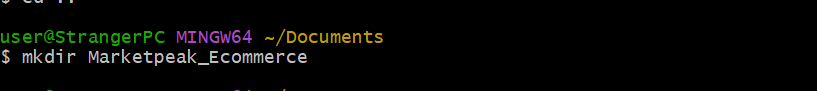

## Task 1.2
 I was able to obtain an ecommerce website template on a website, well it's really not an ecommerce website template but almost.
 

 ## Task 1.3
 I staged, commit the messages. I added the files from the templates downloaded. I set git global configuration
 
 Commit message 

 
 
 I had no issues during the implementation of version control. Moving on the the AWS Deployment

 # AWS Deployment 
 I have an AWS account already so i just logged into it 
 
 ## Task 2.1 
 I logged in to my ec2 instance using Ubuntu 24.04, connected it using SSH
 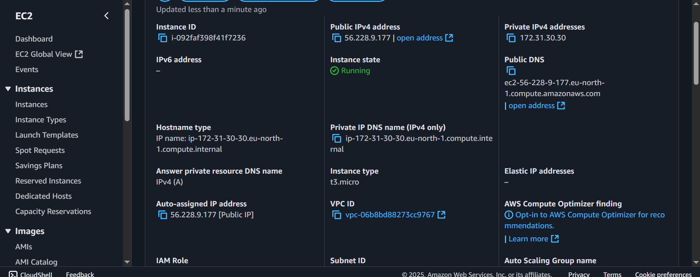

## Task 2.2
I cloned git into linux server for work effeciency, i used HTTPS to clone into it
 

## Task 2.3
I installed a web server using (sudo apt intall apache2). Tried using "sudo yum update -y" but won't go through because i didnt use Red-Hat based Linux, so i used ubuntu. Then i started the web server.
So i started my apache2 
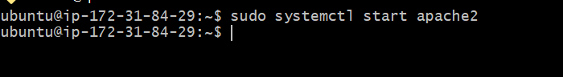 
then i check the status of the Http server
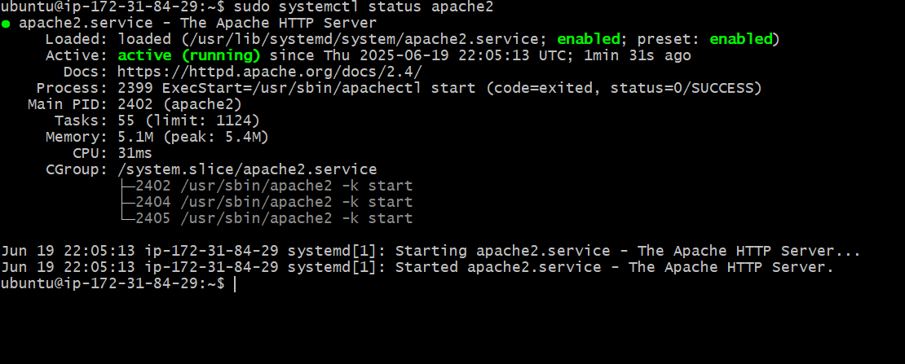

## Task 2.4
I configured the website to the Market_ecommerce file using "sudo rm -rf /var/www/html/*
sudo cp -r ~/MarketPeak_Ecommerce/* /var/www/html/" here is a picture of it but the problem was that i couldn't capture the part i used 
"sudo rm -rf /var/www/html/"

Then i reloaded my apache2 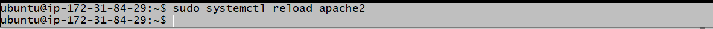

## Task 2.5 
To access the webpage using my public address was successful 

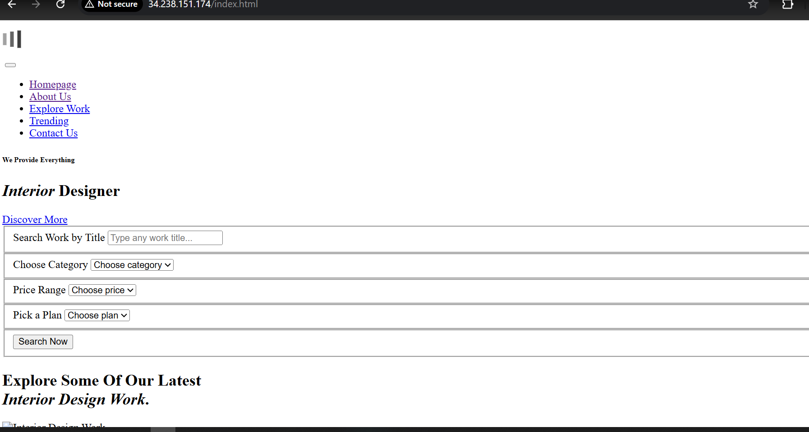

## Continous Intergration Workflowws
To  start continous integration workflow where i can fix bugs and add more features to my code so i introduced git branching, so i created development branch
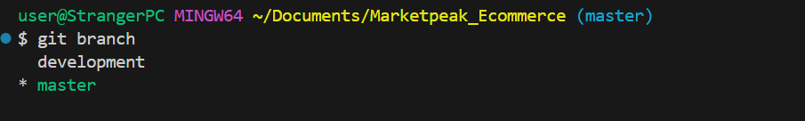 then i switched to the branch

After the creation of a new branch i switched to the new branch then i added the new features i wanted to add then i staged and commit
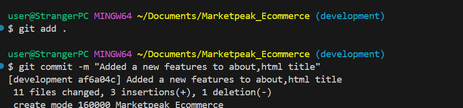

After that i pushed to github for version tracking
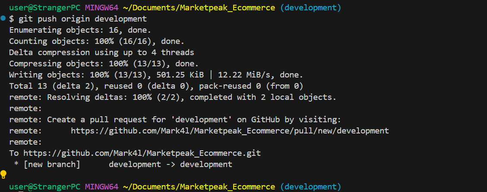

Then I checked out from development branch
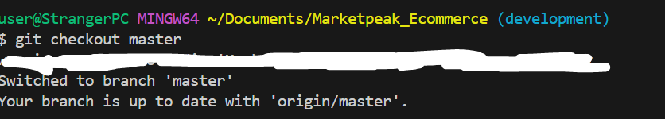

After the checking out from the development branch a pull request
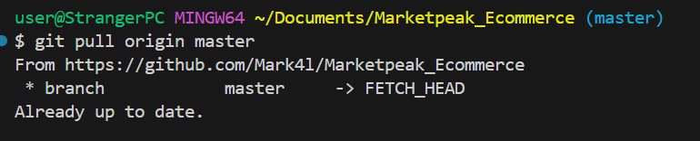

then i merged the two branches together

